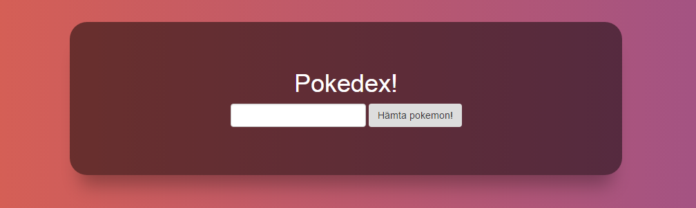

# Andra steget: Styla sidan med CSS

Du har nu en rätt imponerande sida med en titel, en knapp och ett textfält på. Tungt! Det enda problemet är dock att sidan ser förjävlig ut, det är dags att lägga till lite skön **styling** med hjälp av CSS!.

CSS står för **cascading style sheets** och används för att beskriva hur du vill att dina HTML-element ska se ut.

##Bakgrund

Vi börjar med att ge sidan en tuff bakgrund. Skriv detta i css-rutan i codepen:

```
body {
  background: linear-gradient(left, #e96443, #904e95);
}
```

Body-taggen omsluter hela sidan, dock syns den inte i codepen för enkelhetens skull. Det vi gör här är att säga att body-taggen ska ha en bakgrund som är en så kallad gradient, en övergång mellan två färger.

Koderna ***#e96443*** och ***#904e95*** beskriver den första, respektive andra färgen. Om du använda egna färger kan du generera egna färgkoder [här](https://www.google.se/webhp?sourceid=chrome-instant&ion=1&espv=2&ie=UTF-8#q=color+picker). Eller välja mellan andra färdiga gradients [här](http://uigradients.com/#).

## Snygga till resten

För att man ska kunna hitta HTML-taggar från CSS-filen så kan man ge taggarna **klasser**.
```
<div class="wrapper">
  <h1>Pokedex!</h1>
```

Man kan sedan style just den taggen genom att i CSS-filen ange en punkt framför klassnamnet. Vi kan börja med att ge div-taggen en bakgrundsfärg så att vi ser den!
```
.wrapper {
  background-color: rgba(0,0,0,0.5);
}
```

Bra! Men det ser fortfarande ganska fult ut, lägg till lite mer stil i wrapper-klassen. Experimentera gärna själv! Text som skrivs efter två snedstreck '//' kallas kommentarer och kommer ignoreras av kompilatorn!

```
.wrapper{
  background-color: rgba(0,0,0,0.5);
  margin: auto; // Centrera denna div-taggen
  text-align: center; // Centrera innehållet
  max-width: 800px; // Denna taggen får max vara 800px bred
  border-radius: 25px; // Runda taggens hörn med 25px
  padding: 50px; // Lägg till 50px andrum inne i taggen.
  margin-top: 100px; // Lägg till 50px andrum utanför i taggen.
  box-shadow: 0 30px 40px -15px rgba(0,0,0,0.3); // Ge rutan en skugga
}
```

## Uppgift: Gör h1-taggen vit!

Man ser rubriken lite dåligt, gör den vit (eller någon annan färg)!

Om du har följt tidigare instruktioner bör din sida nu se ut ungefär såhär:



Men förhoppningsvis har du experimenterat lite själv också! :)

###[Gå till steg 3](https://github.com/amygdaloideum/SBAB-pokedex-helloworld/tree/master/docs/phase-3)
