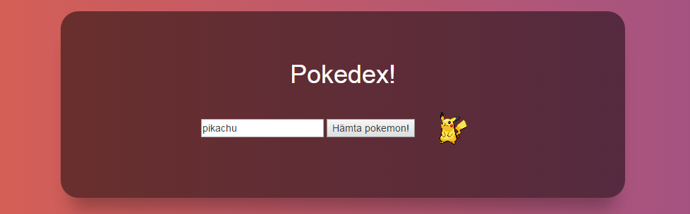

# Tredje steget: Skriv funktionalitet

Du har nu en ganska fet hemsida på G. Den är dock helt värdelös eftersom den inte gör någonting! Det är nu dags att med hjälp av Javascript och AngularJS koppla funktionalitet till våran HTML.

## AngularJs intro

Första steget är att koppla på angularJS på din omslutande div-tagg:

```
<div ng-app="pokeDexApp" ng-controller="pokeCtrl" class="wrapper">
```

Det denna koden gör är att berätta för kompilatorn att du vill använda angular-appen "pokeDexApp" och att **controllern** för denna vy skall vara "pokeCtrl". 
 
**Controllers** i angular är moduler av kod som används för att "kontrollera" specifika delar av HTML-koden. I vårt fall våran div-tagg! Dvs att "pokeCtrl" ska innehålla funktionaliteten för alla taggar som är under elementet med **ng-controller**-attributet på sig.

Klistra nu in följande kod i JS-rutan i codepen:

```
angular
  .module('pokeDexApp', []) //Skapa angular-appen
  .controller('pokeCtrl', pokeCtrl); //Skapa en controller

function pokeCtrl($scope, $http){
  // Här kommer funktionaliteten skrivas snart
}
```

### Förifyllt värde & databindning

En smidig grej med angular är tvåvägs-databindning mellan controllern och vyn. Sätt attributet **ng-model="name"** på din input-tagg (textfältet).

```
<input ng-model="name"/>
```

Texten i fältet kommer nu att synkas mot variabeln **$scope.name** i controllern. Så när du ändrar texten kommer värdet i variabeln ändras, och vice versa! Vi kan använda detta för att sätta ett förifyllt värde i fältet:
```
function pokeCtrl($scope, $http){
  $scope.name = 'pikachu';
}
```

Alla variabler som sätts på **$scope** kommer att kunna användas av våran HTML. Om du vill ha en privat variabel som inte är tillgänglig för vyn, så är det bara att deklarera den på vanligt vis i controllern.

```
function pokeCtrl($scope, $http){
  $scope.name = 'pikachu'; // Den här är tillgänglig för vyn
  var secretPokemon = 'bulbasaur'; // Den här variabeln gömd från vyn!
}
```

### Klickhändelse

Nu ska vi testa att göra en funktion som körs när man klickar på HTML-knappen. Detta fungerar på liknande sätt som databindningen i angular, vi sätter attributet **ng-click="getPokemon()"** på knappen. Så när vi klickar på knappen kommer angular kolla i vår controller efter en funktion som heter 'getPokemon' och köra den funktionen!

```
 <button ng-click="getPokemon()">Hämta pokemon!</button>
```

```
function pokeCtrl($scope, $http){
  $scope.name = 'pikachu'; // Den här är tillgänglig för vyn
  
  $scope.getPokemon = function(){
    //Denna kod kommer köras när du klickar på knappen
    alert('What up?!');
  }
}
```

### Prata med pokemon-servern

Nu är det dags att kommunicera med pokeApi för att få tag i lite skön pokemon-data!

Adressen till servern vi kommer prata med är 'http://pokeapi.co/api/v2/pokemon/'. Man kan anropa servern med antingen ett pokemon-namn 'http://pokeapi.co/api/v2/pokemon/pikachu' eller med en siffra 'http://pokeapi.co/api/v2/pokemon/1'. Testa att klistra in adresserna i webbläsaren för att se hur datat du får tillbaka ser ut!

Du ser nu massa cool hacker-text som ser betydligt svårare ut än vad den är! Men om några minuter kommer du kunna använda datat för att visa en bild på den pokemon du sökt efter.

Vi börjar med att lagra URL:en (adressen) till servern i en privat variabel i vår controller:

```
function pokeCtrl($scope, $http){
  var serverUrl = 'http://pokeapi.co/api/v2/pokemon/';

  $scope.name = 'pikachu'; // Den här är tillgänglig för vyn
```

Sedan fyller vi på funktionen vi gjorde förut som anropades när vi klickade på knappen. Detta gör vi genom att använda angular-tjänsten **$http**:
 
```
 function pokeCtrl($scope, $http){
   var serverUrl = 'http://pokeapi.co/api/v2/pokemon/';
   $scope.name = 'pikachu'; // Den här är tillgänglig för vyn
   
   $scope.getPokemon = function(){
     $http.get(pokeUrl + $scope.name).then(showPokemon);
   }
   
   function showPokemon(pokemon){
     $scope.pokemon = pokemon.data;
   }
 }
 ```
 
Wow! Låt oss kolla lite närmare på vad vi lagt till:

- **$http.get()** gör ett anrop till adressen vi anger inom paranteserna
- **pokeUrl + $scope.name** klistrar ihop adressen till servern med namnet vi angett i fältet!
- Severn gör alltså ett anrop till 'http://pokeapi.co/api/v2/pokemon/pikachu'
- **.then()** kommer köra funktionen vi anger mellan paranteserna när anropet är klart.
- funktionen **showPokemon()** sätter datat vi tagit emot till variabeln **$scope.pokemon**. 
- **$scope.pokemon** kommer alltså efter anropet innehålla data som vi kan komma åt från vår HTML!

Okej, men det syns ju inget på skärmen? Det måste vi fixa! Vi får med en URL till en bild av pokemonen vi sökte på i datat. Vi kan visa den bilden på följande vis:

```
 <div div ng-app="pokeDexApp" ng-controller="pokeCtrl" class="wrapper">
   <h1>Pokedex!</h1>
   <input ng-model="name"/>
   <button ng-click="getPokemon()">Hämta pokemon!</button>
   
 </div>
```

Så, när du söker efter en pokemon borde nu en bild visas!



###[Gå till steg 4](https://github.com/amygdaloideum/SBAB-pokedex-helloworld/tree/master/docs/phase-4)